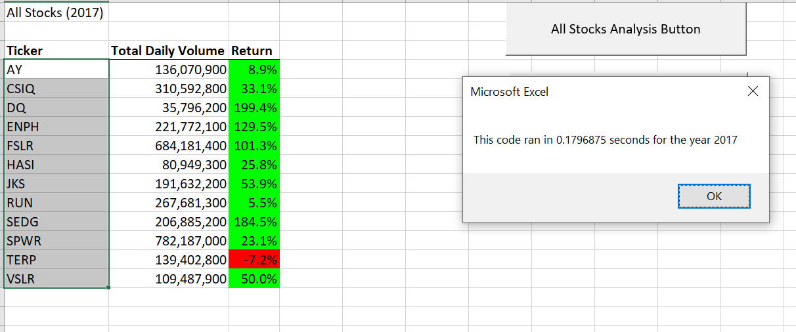
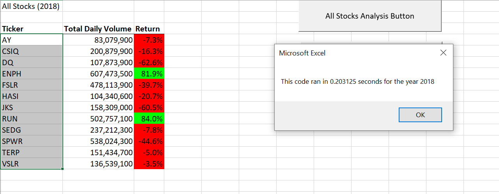
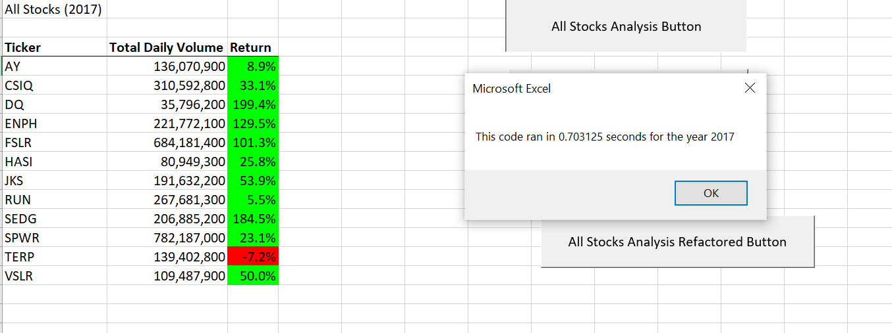
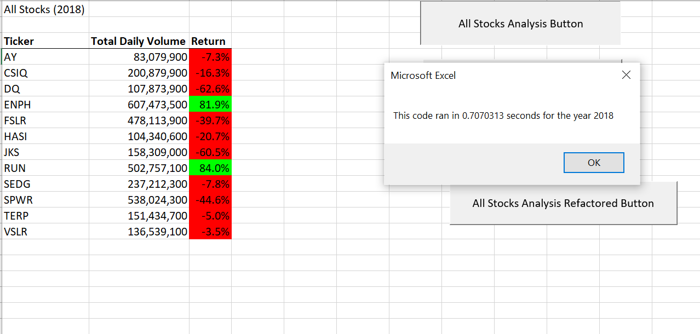

# VBA of Wall Street

## **Overview**: The purpose of this analysis was to enable Steve to run an analysis of the stock market over the last 2 years, to allow him to determine which stocks to invest in.

### In the Bootcamptspot Module lesson, we had originally set up the VBA code to work well for 12 initial stocks, but if Steve wanted to use this format for a multitude of stocks, it would not be efficient and run fast. Hence, we edited our intial code to run faster, i.e. we *refactored* it. 

## **Results**:

1) The results for the 2017 and 2018 stock analyses using both the AllStockAnalysis and the AllStockAnalyisRefactored are the same

2) The refactored code runs faster than the original All Stocks Analysis code: 

For 2017, the original All Stocks Analysis code ran in 0.7 seconds, while the refactored code ran in 0.2 seconds
For 2018, the original All Stocks Analysis code ran in 0.7 seconds, while the refactored code ran in 0.2 seconds

Below are the screenshots of the 4 sets of run times:

a. ***Using the refactored code:***

b. ***Using the original code:***

3) Through this quick analysis, Steve can clearly see that 2017 was a much better year to invest in any of the 12 stocks he had selected, with the exception of TERP. In contrast, in 2018, only 2 stocks provided positive returns (ENPH and RUN).

Below are the screenshots of the 2 sets of stock returns:

## **Summary**:
 
1. What are the advantages or disadvantages of refactoring code?
The main advantage in refactoring a code is the decrease in the macro run time, as seen above in the 4 screenshots

2. How do these pros and cons apply to refactoring the original VBA script?

###**Pros**: 
- Refactoring allows the code to be more organized and work faster
- It also allows anyone reading our code to quickly understand or debug it if need be

###**Cons**: 
- Refactoring the code takes more time to write.

